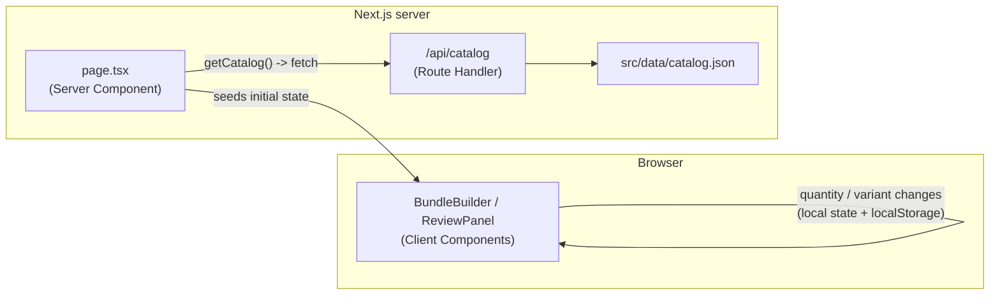
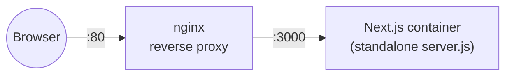

# Bundle Builder

A Wyze-style home security bundle configurator built with **Next.js (App Router)**, **React**,
and **Tailwind CSS**. A 4-step accordion lets a shopper pick cameras, a plan, sensors, and
accessories; a live "Your security system" review panel reflects every change instantly, with
totals recalculating in real time.

## Tech stack

| Concern            | Choice                                                              |
| ------------------- | -------------------------------------------------------------------- |
| Framework           | Next.js 16 (App Router, Server Components, Route Handlers)         |
| UI                  | React 19, Tailwind CSS 4                                            |
| Data                | Local JSON catalog, served via a Next.js Route Handler              |
| Client state        | React Context + `localStorage` persistence                          |
| Containerization    | Docker (multi-stage), Docker Compose (dev & prod profiles)          |
| Reverse proxy (prod) | nginx                                                               |

## Architecture



Initial catalog + seed selections are fetched **server-side** (`getCatalog()` in
`src/data/getCatalog.ts`) and passed down to hydrate client state. From then on, all
quantity/variant interactions are client-side (`src/state`), with the review panel deriving its
totals from a single selection store — no client-side re-fetching.



In production, nginx terminates the request, gzips responses, caches `/_next/static/*`
aggressively, and disables buffering so App Router streaming isn't held back — Next.js itself
never needs to be exposed directly to the internet.

## Project structure

```
app/                    routes: page.tsx, layout.tsx, api/catalog/route.ts, loading/error boundaries
src/
  components/           BundleBuilder, BundleStep, ProductCard, ReviewPanel, ReviewLine, ...
  data/                 catalog.json (source of truth), getCatalog.ts (server fetch), types.ts
  state/                selectionStore.tsx (context), derive.ts (pricing/qty logic), persistence.ts
  lib/                  formatPrice.ts
nginx/nginx.conf         reverse proxy config (production only)
Dockerfile                production image (multi-stage, standalone output)
Dockerfile.dev             development image (hot reload)
docker-compose.yml          production: app + nginx
docker-compose.dev.yml      development: app only
```

## Getting started

### Local (Node.js)

```bash
npm install
npm run dev      # dev server at http://localhost:3000, hot reload
npm run build    # production build
npm run start    # serve the production build
```

### Docker — development

Hot reload, source mounted as a volume, no local Node.js install required:

```bash
docker compose -f docker-compose.dev.yml up --build
# app at http://localhost:3000
```

### Docker — production

Multi-stage build using Next's `standalone` output, served behind an nginx reverse proxy:

```bash
docker compose up --build
# app at http://localhost (nginx on :80 -> Next.js on :3000)
```

- `Dockerfile` — `builder` stage installs deps and runs `next build` (emits `.next/standalone`
  per `output: "standalone"` in `next.config.ts`); `runner` stage copies only the traced runtime
  files into a slim final image. No `node_modules` install needed at runtime.
- `Dockerfile.dev` — single-stage image running `next dev` against the mounted source.
- `nginx/nginx.conf` — gzip, long-lived caching for `/_next/static/*`, and
  `proxy_buffering off` / `X-Accel-Buffering: no` so App Router streaming (`loading.tsx`,
  Suspense) isn't buffered away, per the
  [Next.js self-hosting guide](https://nextjs.org/docs/app/guides/self-hosting#streaming-and-suspense).

### Environment variables

| Variable          | Default                          | Purpose                                                   |
| ------------------ | --------------------------------- | ----------------------------------------------------------- |
| `CATALOG_API_URL` | `http://localhost:<PORT>/api/catalog` | Where the server fetches the catalog from. Override if deploying the API separately. |
| `PORT`            | `3000`                            | Port the Next.js server listens on.                        |

## Features

- **4-step accordion** — Step 1 (Cameras) open by default; each step shows a live
  "*N* selected" count and a **Next: …** button to advance.
- **Product cards** — badge, image, description, variant color chips, quantity stepper, and
  compare-at/active pricing, data-driven per product (no hardcoded per-product markup).
- **Variant-aware quantities** — each color variant tracks its own quantity independently; the
  card's stepper reflects whichever variant is currently active, while the review panel lists
  every variant with a count above zero as its own line.
- **Live review panel** — grouped by category (Cameras, Sensors, Accessories, Plan), with
  synced quantity steppers and a running total that recalculates immediately.
- **Persistence** — "Save my system for later" writes the full selection state to
  `localStorage`; reloading or returning restores it exactly.

## Notes

**Font substitution.** The Figma design specifies Gilroy, which is a licensed font not available
for free use. This build substitutes **Poppins** via `next/font/google`, matching Gilroy's
weight range and general proportions as closely as a free font allows.

**Steps 2–4 content.** The Figma file only designs an *expanded* state for Step 1 (Cameras);
Steps 2–4 have collapsed headers only, with no expanded layout to reference. Rather than
inventing a multi-product catalog for those steps, each was populated with the single item the
review panel itself already implies is seeded: Cam Unlimited plan (Step 2), Sense Motion Sensor
and the required Sense Hub (Step 3, sensors), and the Wyze MicroSD Card (Step 4, accessories).
Each reuses the exact same `ProductCard` pattern as Step 1 — no per-step component branching.

**Tradeoffs / unfinished items.**
- Product photography reuses a single photographed color per product (from `context/images/`);
  non-white variant chips swap only the swatch color, not the product photo, since no per-color
  photography exists.
- "Checkout" is a stub confirmation with no real destination, per the brief.
- `app/loading.tsx` and `app/error.tsx` are minimal safety nets rather than designed states —
  the catalog fetch is fast and local, so neither is expected to be visible in normal use.
- No automated test suite is included (no Vitest/Playwright setup). The trickiest logic to cover
  would be `src/state/derive.ts` (quantity/variant derivation) and the persistence fail-open path
  in `src/state/persistence.ts`; both were verified manually instead.
